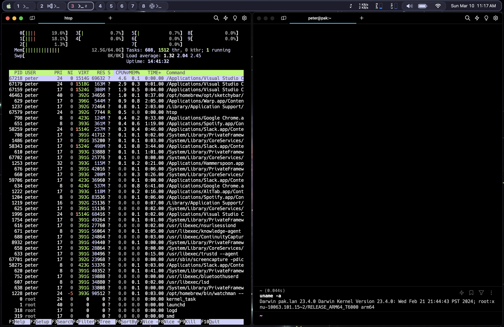

macos rice files
================

macOS unixified.



* yabai -- tiling window manager
* Karabiner-Elements -- settings CAPSLOCK as hyper key (alt+ctrl+shift)
* Hammerspoon -- programmable Lua interfaces for global keyboard hotkeys, fast app launching/switching and spaces/windows controls
* Sketchybar -- custom menu bar

## Install

First, install: [Karabiner-Elements](https://karabiner-elements.pqrs.org/)
if you'd like to setup the CAPSLOCK as your global hyper key (alt+ctrl+shift).
https://karabiner-elements.pqrs.org/

Second, install:
* [yabai](https://github.com/koekeishiya/yabai)
* [Hammerspoon](https://www.hammerspoon.org/)
* [Sketchybar](https://github.com/FelixKratz/SketchyBar)
	* brew install --cask sf-symbols

Third, copy the macrice repo if you'd like to get started with the
same setup as in screenshot:

```bash
cd ./config
git clone git@github.com:pkieltyka/macrice.git
cd ./macrice
ln -s `pwd`/hammerspoon $HOME/.hammerspoon
ln -s `pwd`/yabai $HOME/.config/yabai
ln -s `pwd`/sketchybar $HOME/.config/sketchybar
```
